# Remote backend
This is a demonstration of setup remote backend using Terraform Cloud and AWS
## Step 1. Login to terraform cloud
Login to terraform cloud follow this [link](https://app.terraform.io/app)
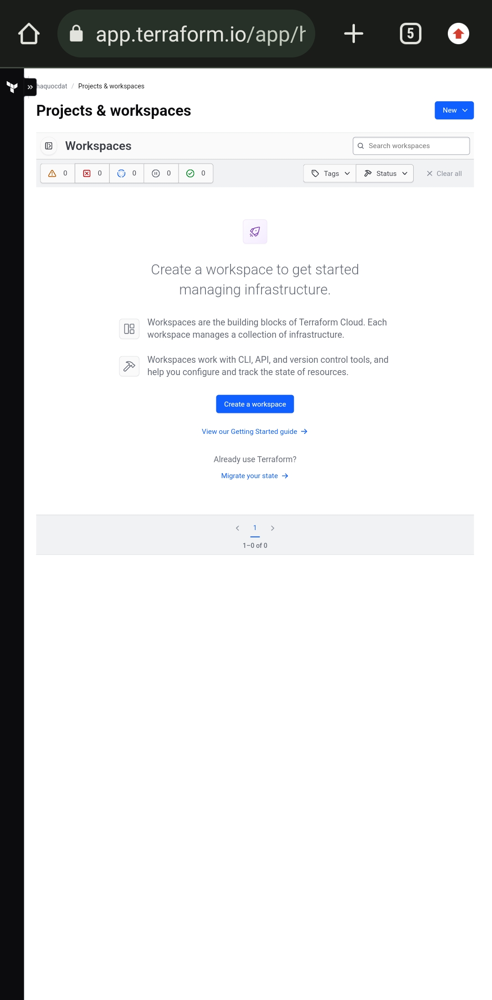
## Step 2. Create new project ( Choose CLI driven workflow )
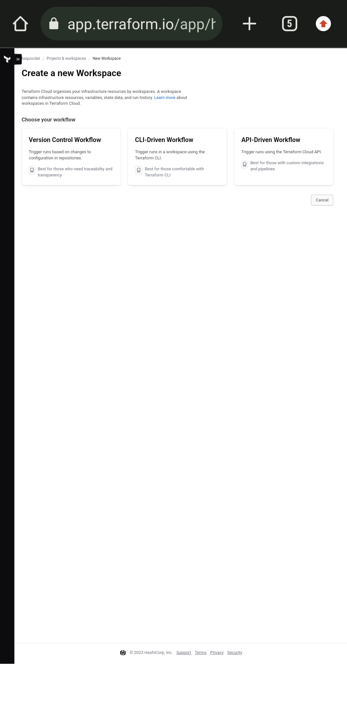
## Step 3. Give it a name and description
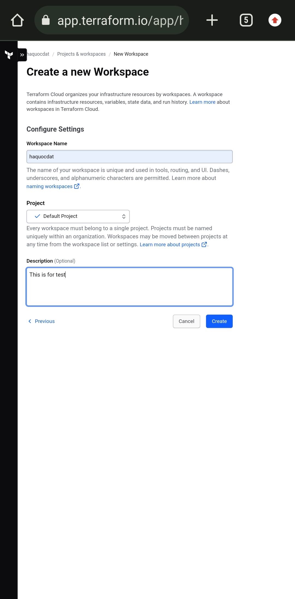
## Step 4. Read instructions
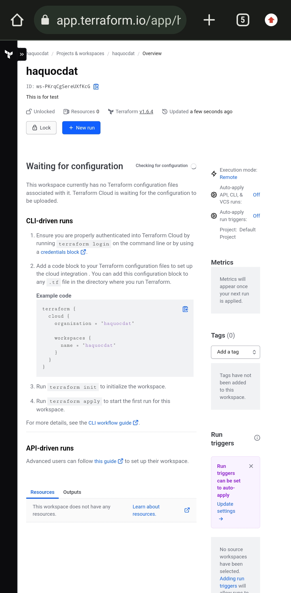
## Step 5. Copy the example code to your code
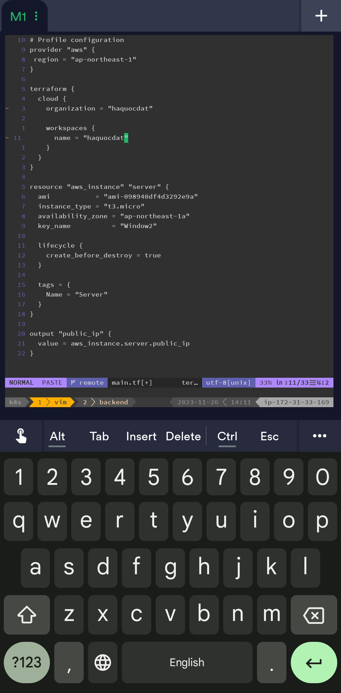
## Step 6. Run `terraform login` Copy the link on screen and open it kn browser
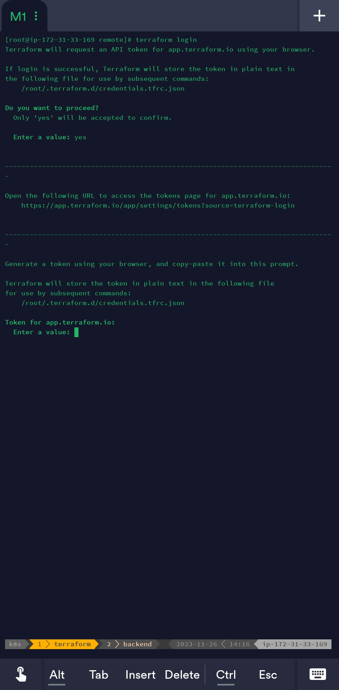
## Step 7. Create an API token
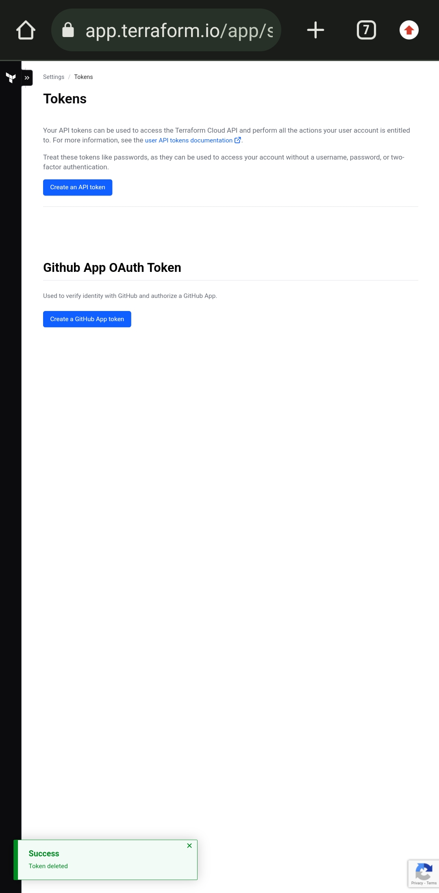
## Step 8. Give it a name and expiration date
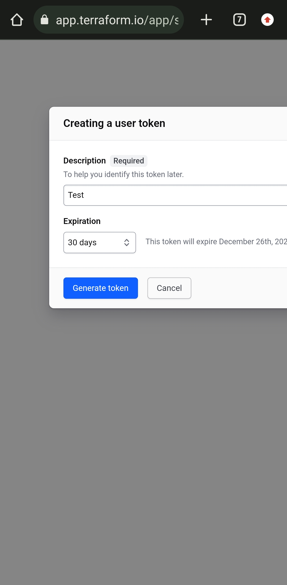
## Step 9. Copy API token
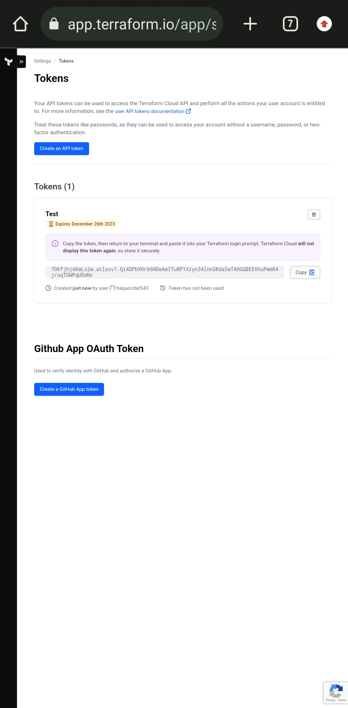
## Step 10. Enter API token

## Step 11. Login successfully
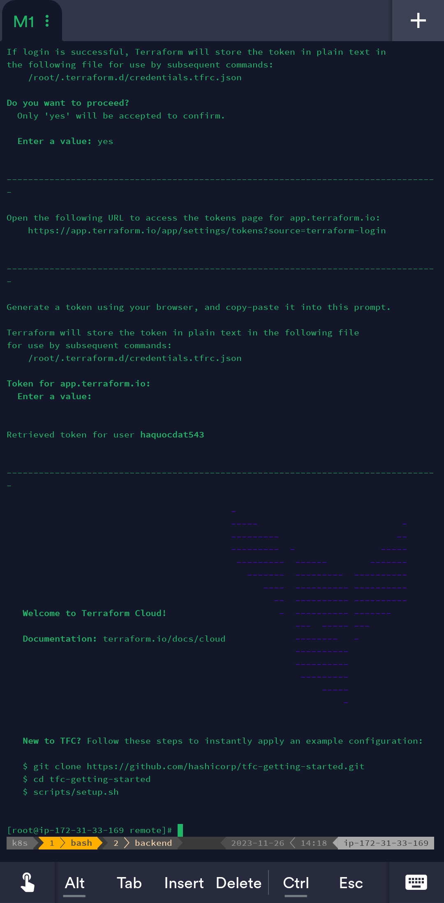
## Step 12. Terraform init
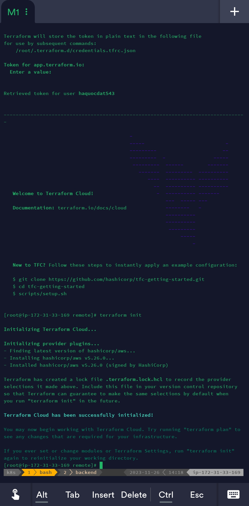
## Step 13. Create Variables
Set up two below variables follow your AWS access key and secret key
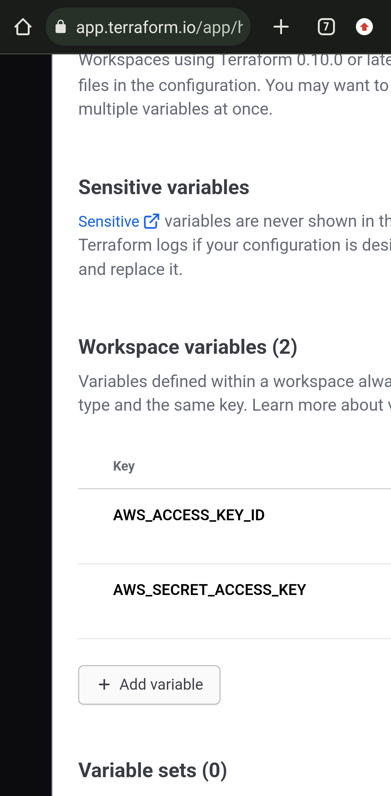
## Step 14. Terraform apply
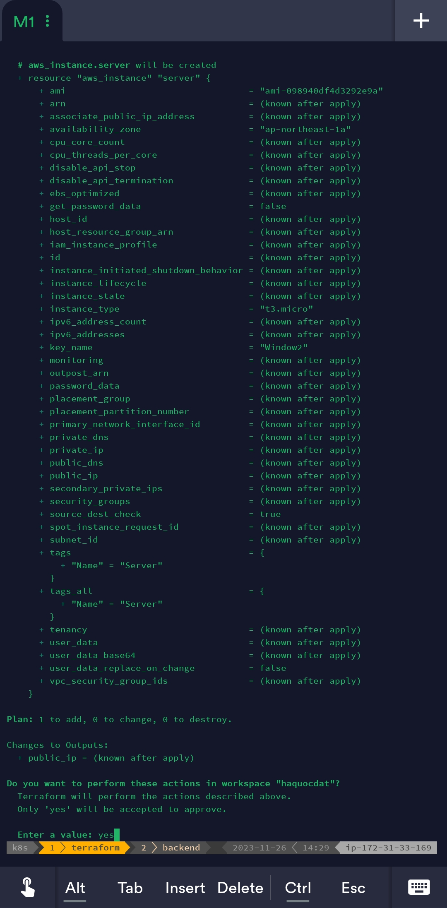
## Step 15. Successfully
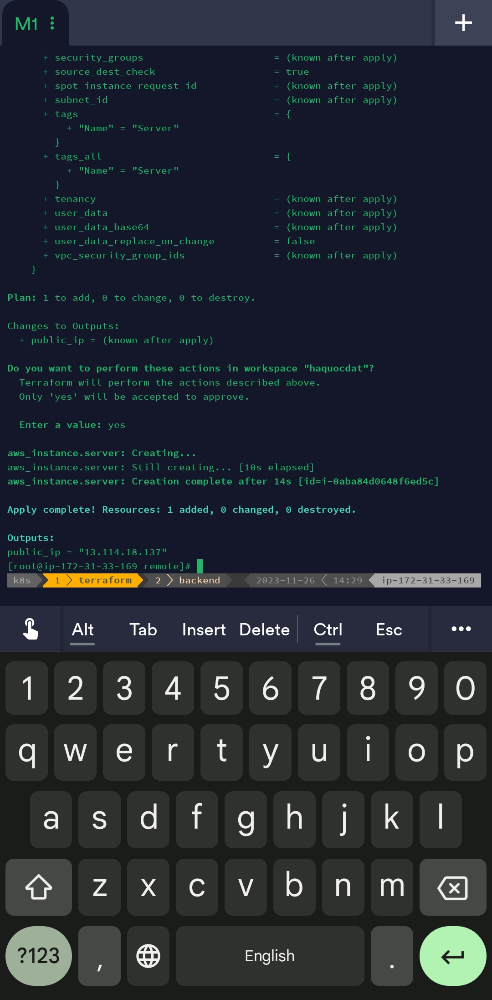
## Step 16. Terraform cloud console view detail
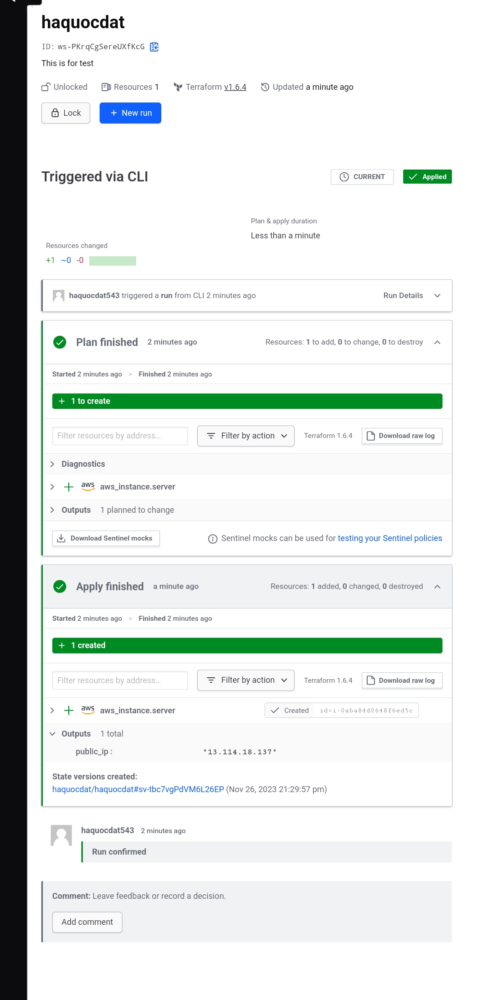
## Step 17. Terraform cloud console view
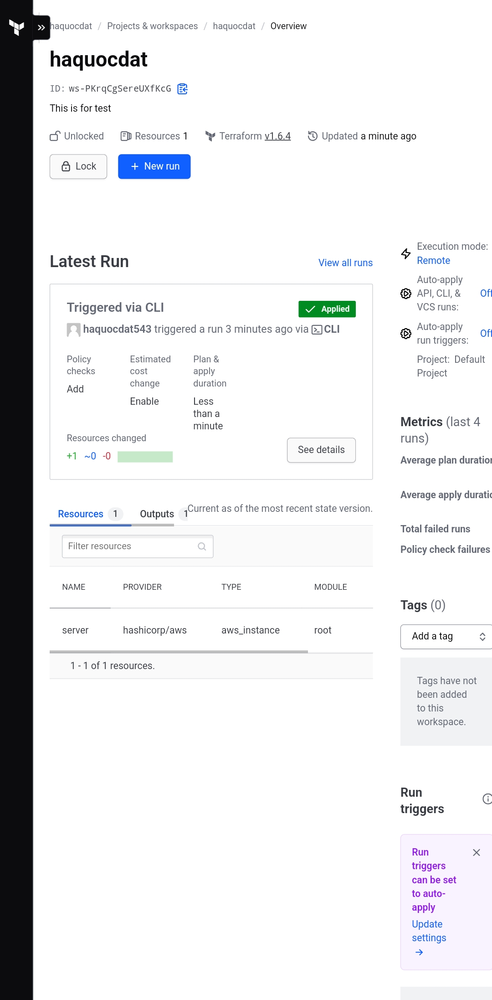
## Step 18. Terraform destroy

## Step 19. Destroying
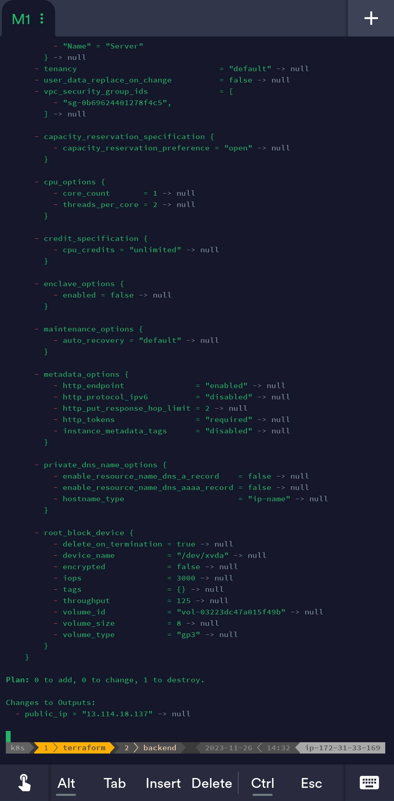
## Step 20. Destroyed successfully
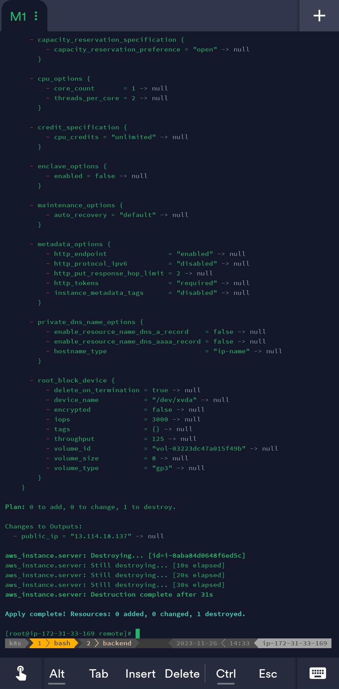
## Step 21. Terraform cloud console view 
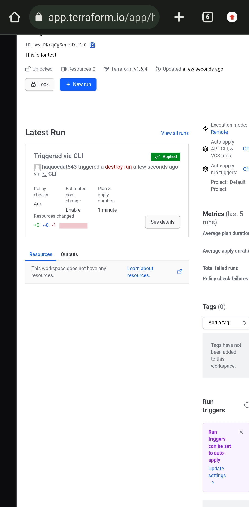
## Step 22. Terraform cloud console view detail
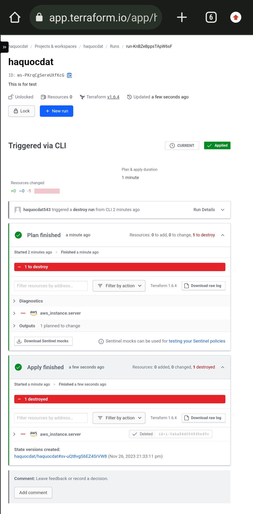
